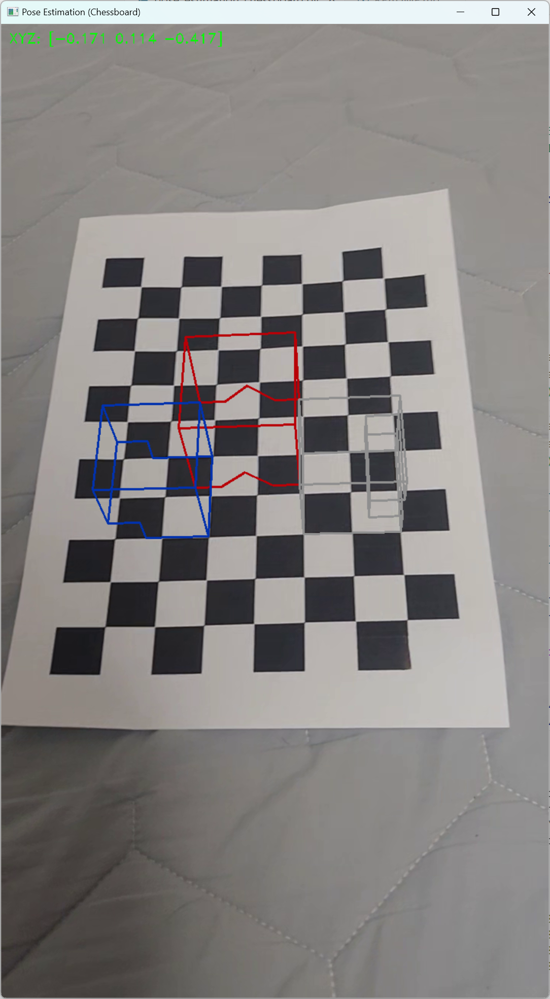

# Simple_AR
간단한 AR 구현 예전

# 개요
[Camera_Distortion_Corrector](https://github.com/Timeshifts/Camera_Distort_Corrector)에서 이어지는 예제로,
카메라의 Calibration 값을 이용하여 현재 카메라의 pose를 알아내고, 이를 바탕으로 3차원 공간에 물체를 그려내는 예제입니다.
data 폴더의 `ChessBoard.mp4` 파일을 기준으로 합니다.

# 카메라 Calibration 결과
## Camera Calibration Results
* The number of selected images = 20
* RMS error = 0.9895495508143434
* Camera matrix (K) =
[[1.18808292e+03 0.00000000e+00 3.51696936e+02]
 [0.00000000e+00 1.18650185e+03 6.24902687e+02]
 [0.00000000e+00 0.00000000e+00 1.00000000e+00]]
* Distortion coefficient (k1, k2, p1, p2, k3, ...) = [ 0.02205492  0.47085272 -0.01021119  0.00712299 -1.24242936]

# AR 구현 결과

## 보정 이후

# 참고
이 코드는 [다음의 코드](https://github.com/mint-lab/3dv_tutorial/blob/master/examples/pose_estimation_chessboard.py)를 기반으로 하여 작성되었습니다.